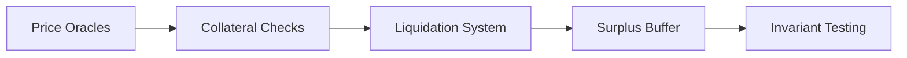
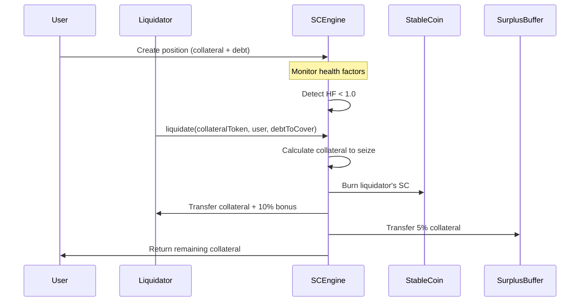

# Decentralized Stablecoin System

[![Foundry][foundry-badge]][foundry-url]
[![Solidity][solidity-badge]][solidity-url]
[![Chainlink][chainlink-badge]][chainlink-url]

A decentralized, overcollateralized stablecoin protocol inspired by MakerDAO, featuring algorithmic stability mechanisms and liquidation systems.

## Key Features

- **Stablecoin (SC)**: ERC-20 token pegged to USD
- **Collateral Engine**: Secures stablecoin with multiple assets
- **Overcollateralization**: Minimum 133% collateralization ratio
- **Liquidation System**: Automated liquidation of undercollateralized positions
- **Price Oracles**: Chainlink integration for real-time pricing
- **Surplus Buffer**: Protocol-owned reserve for system stability

## Security Architecture

### Defense-in-Depth Approach


### Core Security Measures
1. **Chainlink Oracle Safeguards**
   - Stale price detection (1-hour timeout)
   - Zero/negative price validation
   - Multi-source price feeds
   - Decentralized node operators

2. **Collateral Protection**
   - Minimum 133% collateralization ratio
   - Multi-asset diversification (ETH, BTC, etc.)
   - Real-time health factor monitoring

3. **Liquidation Mechanism**
   - Automatic undercollateralization response
   - Incentivized liquidator participation
   - Surplus buffer backstop

4. **Systemic Risk Mitigation**
   - Protocol-owned surplus buffer
   - Partial liquidation support
   - Fuzz/invariant testing coverage

5. **Code Security**
   - Reentrancy protection (OpenZeppelin)
   - Arithmetic overflow guards
   - Input validation on all user actions

## Liquidation Mechanism

### Overview
The liquidation system ensures protocol solvency by liquidating undercollateralized positions (health factor < 1.0). 

### Process Flow


### Key Components
1. **Health Factor Calculation**  
   ```
   Health Factor = (Total Collateral Value × 75%) / Total SC Minted
   ```

2. **Liquidation Incentives**
   - Liquidator receives 110% value of covered debt in collateral:
     - 100% for debt repayment
     - 10% bonus as incentive
   - Protocol retains 5% for surplus buffer

3. **Surplus Buffer Protection**
   - Covers collateral shortfalls during extreme events
   - Funded by 5% of all liquidated collateral
   - Accepts voluntary deposits

4. **Partial Liquidation**
   - Positions can be partially liquidated
   - Minimum liquidation amount: 1 SC
   - Health factor must improve post-liquidation

### Example Scenario
- **User Position**:  
  - Collateral: 1 ETH ($2000)
  - Debt: 1500 SC
  - Health Factor: (2000 × 0.75) ÷ 1500 = 1.0

- **ETH Price Drops to $1800**:  
  Health Factor = (1800 × 0.75) ÷ 1500 = 0.9

- **Liquidation (Cover 1000 SC debt)**:
  - Collateral Seized: (1000 × 1.1) ÷ 1800 = 0.611 ETH
    - Liquidator receives: 0.611 ETH
    - Protocol surplus: 0.611 × 0.05 = 0.03055 ETH
  - User retains: 1 - 0.611 = 0.389 ETH
  - User's new debt: 500 SC

## Acknowledgments

Special thanks to **Patrick Collins from Chainlink** for his exceptional educational content. This project implements concepts learned from his comprehensive blockchain development tutorials. His teaching made complex DeFi concepts accessible and provided the foundation for this implementation.

## Future Improvements

While functional, this implementation would benefit from:
- [ ] Enhanced liquidation incentives
- [ ] Dynamic stability fees
- [ ] Governance module
- [ ] Multi-chain deployment
- [ ] Formal verification

I plan to refine these areas when time permits. Contributions welcome!

## Getting Started

### Prerequisites
- Foundry (v0.2.0+)

### Installation
```bash
git clone https://github.com/dekib/decentralized-stablecoin.git
cd decentralized-stablecoin
forge install
```

### Testing
Run all tests:
```bash
forge test
```

Run invariant tests:
```bash
forge test --mt invariant_protocolMustBeOvercollateralized -vvv
```

### Deployment
1. Update `script/HelperConfig.s.sol` with network parameters
2. Run deployment script:
```bash
forge script script/DeploySC.s.sol --broadcast --verify
```

## License
This project is licensed under the MIT License - see [LICENSE](LICENSE) for details.

[foundry-badge]: https://img.shields.io/badge/Built%20with-Foundry-FFDB1C.svg
[foundry-url]: https://getfoundry.sh
[solidity-badge]: https://img.shields.io/badge/Solidity-0.8.28-363636.svg
[solidity-url]: https://soliditylang.org
[chainlink-badge]: https://img.shields.io/badge/Powered%20by-Chainlink-375BD2.svg
[chainlink-url]: https://chain.link