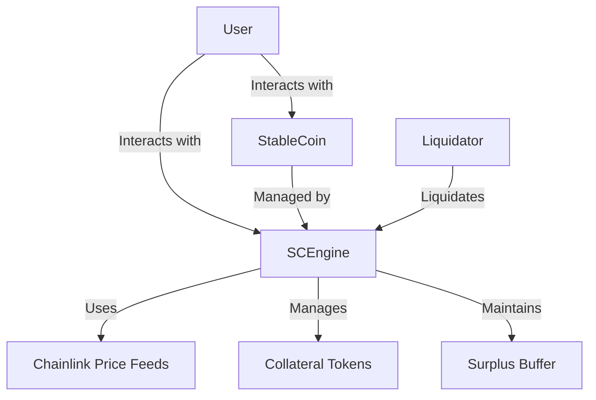
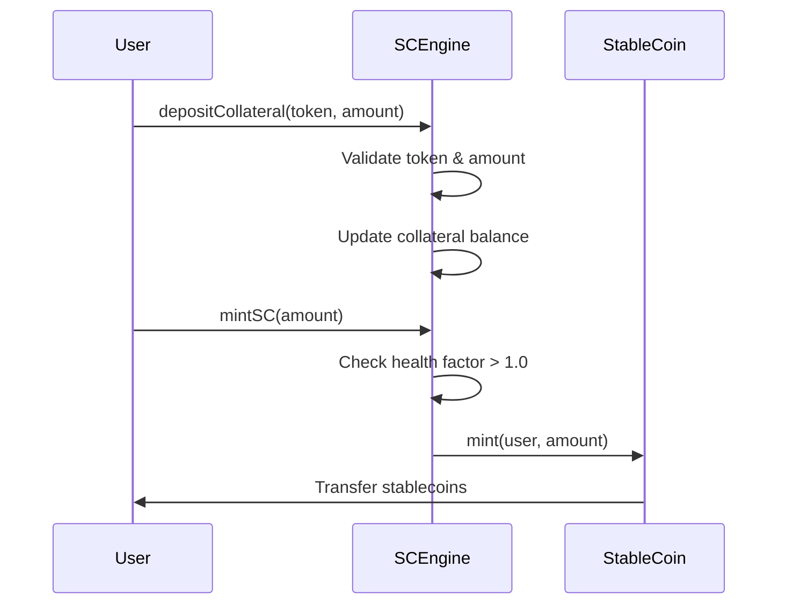
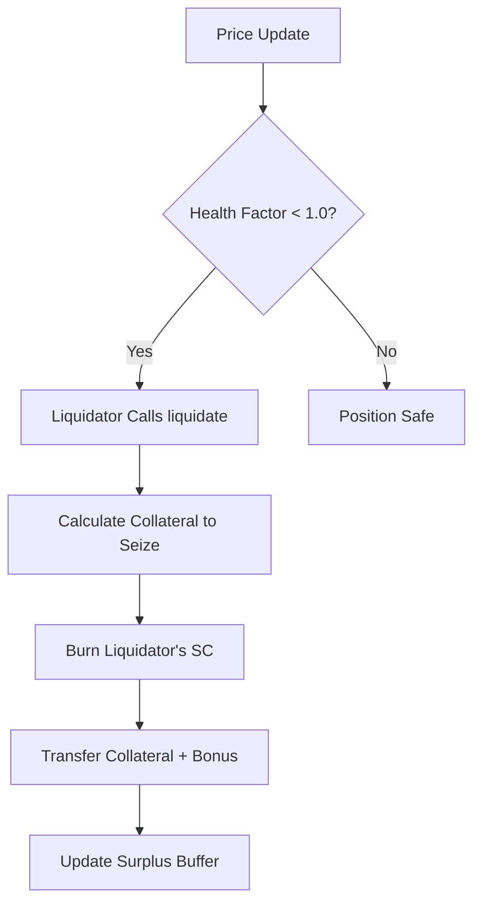
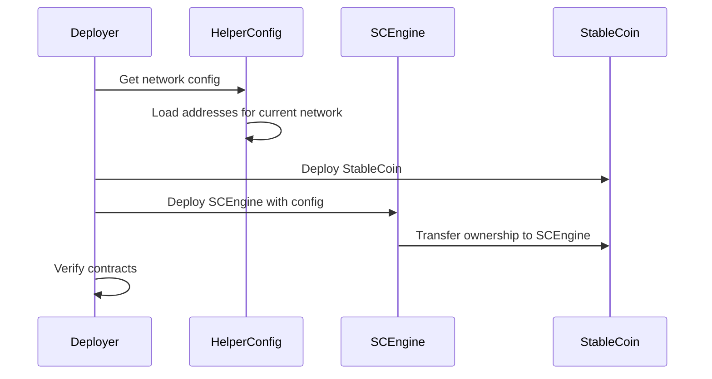
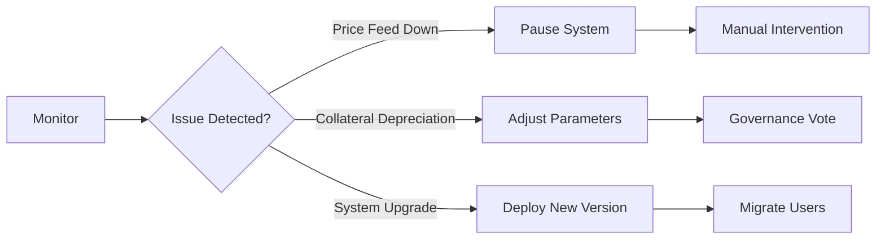

# Technical Documentation: Decentralized Stablecoin System

## 1. Architecture Overview

### System Components


### Contract Relationships
- **StableCoin.sol**: ERC-20 token implementation with mint/burn functionality
- **SCEngine.sol**: Core system managing collateral, minting, and liquidation
- **HelperConfig.sol**: Deployment configuration utility
- **DeploySC.s.sol**: Foundry deployment script

## 2. Core Mechanisms

### 2.1 Stablecoin Minting Process


### 2.2 Liquidation Workflow


### 2.3 Health Factor Calculation
```
Health Factor = (Total Collateral Value × Liquidation Threshold) / Total SC Minted

Where:
- Liquidation Threshold = 75%
- Minimum Health Factor = 1.0
- Total Collateral Value = Σ(collateral_amount × price)
```

## 3. Contract Specifications

### StableCoin.sol
| Function           | Parameters              | Description                                  |
|--------------------|-------------------------|----------------------------------------------|
| `mint`             | `address to, uint256 amount` | Mints new stablecoins (owner only)       |
| `burn`             | `uint256 amount`        | Burns stablecoins (owner only)               |
| `transferFrom`     | `address, address, uint256` | Overridden ERC-20 transfer function      |

### SCEngine.sol
| Function           | Parameters                          | Description                                  |
|--------------------|-------------------------------------|----------------------------------------------|
| `depositCollateral`| `address token, uint256 amount`     | Adds collateral to user's position           |
| `mintSC`           | `uint256 amount`                    | Mints stablecoins against collateral         |
| `redeemCollateral` | `address token, uint256 amount`     | Withdraws collateral from position          |
| `liquidate`        | `address token, address user, uint256 debt` | Liquidates undercollateralized position |
| `getHealthFactor`  | `address user`                      | Returns user's health factor                |

## 4. Price Oracle Integration

### Chainlink Feed Requirements
```solidity
interface AggregatorV3Interface {
  function latestRoundData() external view returns (
      uint80 roundId,
      int256 answer,
      uint256 startedAt,
      uint256 updatedAt,
      uint80 answeredInRound
  );
}
```

### Validation Checks
1. `answer > 0` (positive price)
2. `updatedAt != 0` (valid round)
3. `block.timestamp - updatedAt < 1 hour` (fresh data)

## 5. Testing Methodology

### Test Structure
```
test/
├── fuzz/
│   ├── Handler.t.sol      // Invariant test handler
│   └── InvariantsTest.t.sol // Core invariant tests
├── unit/
│   └── SCEngineTest.t.sol // Unit tests
└── mocks/                 // Mock contracts
```

### Key Test Cases
1. **Unit Tests**:
   - Collateral deposit/withdrawal
   - Stablecoin minting/burning
   - Health factor calculations
   - Liquidation scenarios

2. **Invariant Tests**:
   - Protocol always overcollateralized
   - Health factors remain safe
   - System balances consistency

### Running Tests
```bash
# Run all tests
forge test

# Run specific invariant test
forge test --mt invariant_protocolMustBeOvercollateralized -vvv

# Run tests with gas report
forge test --gas-report
```

## 6. Deployment Process

### Deployment Script Workflow


### Deployment Commands
```bash
# Dry-run deployment
forge script script/DeploySC.s.sol -f ethereum --dry-run

# Deploy to Sepolia testnet
forge script script/DeploySC.s.sol --rpc-url $SEPOLIA_RPC_URL \
--broadcast --verify -vvvv

# Verify contracts
forge verify-contract --chain-id 11155111 --watch \
--constructor-args $(cast abi-encode "constructor(address[])" "[0x...]") \
0xCONTRACT_ADDRESS src/SCEngine.sol:SCEngine
```

## 7. Security Considerations

### Risk Mitigation Strategies
| Risk Category       | Mitigation Strategy                         |
|---------------------|---------------------------------------------|
| Price Oracle Failure| Multi-source feeds, staleness checks        |
| Under-collateralization | 133% minimum ratio, liquidation incentives |
| System Insolvency   | Surplus buffer (5% of liquidations)         |
| Smart Contract Risks| Fuzz testing, reentrancy guards             |

### Audit Recommendations
1. Add circuit breaker for emergency shutdown
2. Implement time-locked upgrades
3. Add multi-sig for critical operations
4. Conduct formal verification of core math
5. Implement slippage protection in liquidations

## 8. Monitoring and Maintenance

### Key Metrics to Monitor
1. **System Health**:
   - Total collateral value
   - Total stablecoin supply
   - Average health factor

2. **Liquidation Activity**:
   - Number of liquidations
   - Liquidated amounts
   - Surplus buffer growth

3. **Oracle Performance**:
   - Price freshness
   - Feed availability
   - Deviation alerts

### Maintenance Procedures


## 9. Future Improvements

### Roadmap
1. **Q3 2023**:
   - Governance module implementation
   - Dynamic fee structure

2. **Q4 2023**:
   - Cross-chain collateral support
   - Flash loan integration

3. **Q1 2024**:
   - Real-world asset integration
   - On-chain risk dashboard

### Research Areas
- Optimistic oracle fallback
- Decentralized keepers network
- MEV-resistant liquidations
- Zero-knowledge proof verifications
